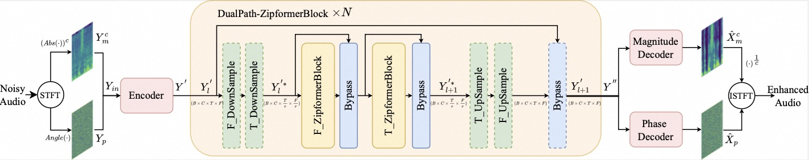

---
tasks:
- acoustic-noise-suppression
widgets:
- task: acoustic-noise-suppression
  inputs:
  - type: audio
    name: input
    title: 带噪音的原始音频
    validator:
      max_size: 10M
  examples:
  - name: 1
    title: 示例1
    inputs:
    - name: input
      data: git://examples/speech_with_noise1.wav
  - name: 2
    title: 示例2
    inputs:
    - name: input
      data: git://examples/speech_with_noise.wav
  inferencespec:
    cpu: 1
    memory: 1000
    gpu: 0
    gpu_memory: 1000
model_type:
- dual-path
domain:
- audio
frameworks:
- pytorch
model-backbone:
- ZipEnhancer
customized-quickstart: True
finetune-support: False
license: Apache License 2.0
tags:
- Alibaba
- ANS
- AI降噪
- 语音增强
- 音频前处理
- 3A
datasets:
  - null
  - modelscope/ICASSP_2021_DNS_Challenge
base_model:
  - iic/speech_zipenhancer_ans_multiloss_16k_base
---
# ZipEnhancer语音降噪模型介绍

用于语音增强任务的最新语音降噪模型。在日常生活中，我们常常会遇到录音环境不佳的情况，比如试图记录一段清晰的语音信息时，周围环境的噪音却不可避免地侵入录音，使得最终录制得到的语音信号中充满了干扰。类似地，在诸如地铁或公交车这类嘈杂的公共场所进行通话时，为了确保通话双方能够听见，人们有时采用提高说话的音量来增强人声信号，来缓解背景噪声的影响。环境噪音对语音通信造成的影响构成了使用语音应用时的一大挑战和障碍。确保语音的高质量传输与高可理解性，常因环境噪声、录音设备的局限性、以及声音的混响和回声效应而变得困难重重，这直接导致了通话清晰度和沟通效率的显著下降。因此，如何在喧嚣的环境里维持高水平的语音质量与可懂度，成为了技术行业和学术界共同努力解决的重要课题。

历经多年的研发探索，语音降噪技术已实现了重要的进展，特别是在应对复杂噪声环境的降噪需求上，采用基于时域、时频域等方法的深度学习神经网络技术，对幅度谱、相位谱以及复数域等声学特征进行高效提取，另外采用双路建模方式提升了语音降噪方法的性能。这些技术能够在极小化语音失真的前提下，高效滤除背景噪音，从而极大地恢复了原始语音的清晰度。这类先进的处理模型也被形象地称为AI语音增强模型。

语音降噪模型的核心功能，在于从充满杂质的音频信号中精准分离并提取出纯净的目标语音，不仅有效提升语音的可听性和可理解性，同时也为语音识别技术的准确度和响应速度带来了显著优化。尤为值得一提的是，我们的语音降噪模型设计精巧，仅需接收单个麦克风录制的原始音频文件作为输入，就能输出经过高效降噪处理的、音质清晰的音频结果。这一过程保持了音频的原始格式不变，仅仅针对性地剔除了噪音与不必要的混响成分，最大化地保存了原始语音的真实性和完整性。

模型的潜在应用场景：
* 在嘈杂的声学环境中降低噪声影响，甚至是消除噪声。
* 改善任意来源的音频声学质量，提升语音清晰度。
* 在各种背景音中提取人声或者背景声。 

**模型支持在线体验啦！**


## 模型描述

ZipEnhancer是阿里巴巴语音实验室提出的基于时频域（TF-Domain）建模的双路（Dual-Path）可进行时频域特征压缩的语音降噪模型。相比于过去的双路语音增强和语音降噪模型，保留额外的频率维度，构建四维的隐层特征(B, T, F, C)，导致了模型的计算量居高不下的问题，我们引入的时频域特征下采样模块，来自定义降低隐层特征维度，减少模型的计算量。

该模型神经网络结构如下图所示。



该模型包括编码器（Encoder）、双路径压缩变压器块（Dual-Path ZipformerBlocks) 、幅度解码器（Magnitude Decoder）和相位解码器(Phase Decoder)。Encoder最初对幅度（Magnitude）和相位（Phase）进行建模以获得隐藏层特征。随后，Dual-Path ZipformerBlocks使用DownSampleStacks和FT-ZipformerBlocks对频域和时域进行顺序建模，然后由幅度解码器恢复幅度谱，并由相位解码器显式恢复相位谱。我们利用ZipformerBlock将双路径Block构建为FT-ZipformerBlocks。
此外，我们提出了具有成对的下采样和上采样结构的DownSampleStacks，我们使用成对的DownSample和UpSample模块实现时间或频率长度的对称缩放，以降低计算成本，并在不同分辨率级别对时域和频域信息进行建模。在时间维度进行下采样的模块称为T_DownSample和T_UpSample，而在频率维度进行下采样的模块称为F_DownSample和F_UpSample。
在 DNS Challenge 2020 (DNS2020)和VoiceBank+DEMAND数据集上进行的大量实验证明了我们的ZipEnhancer的效果。

ZipEnhancer优于类似规模的模型，在具有2.04M个参数和62.41FLOPS的情况下，**在DNS2020数据集上实现了新的最先进(SOTA)语音质量感知评估(PESQ)得分3.69**，数据集Voicebank+DEMAND上PESQ达到3.63。

模型输入和输出均为16kHz采样率单通道语音时域波形信号，输入信号可由单通道麦克风直接进行录制，输出为噪声抑制后的语音音频信号。模型输入信号通过STFT变换转换成幅度（Magnitude）和相位（Phase）特征作为输入，并采用ZipEnhancer在时频域上进行有效的双路建模和特征压缩，预测最终的增强幅度和相位，降幅度和相位转化后构建增强后的复数域特征，最后通过STFT逆变换得到增强后语音波形信号。


## 期望模型使用方式以及适用范围


### 如何使用

在安装ModelScope完成之后即可使用```speech_zipenhancer_ans_multiloss_16k_base```进行推理。模型输入和输出均为16kHz采样率单通道语音时域波形信号，输入信号可由单通道麦克风直接进行录制，输出为噪声抑制后的语音音频信号。为了方便使用在pipeline在模型处理前后增加了wav文件处理逻辑，可以直接读取一个wav文件，并把输出结果保存在指定的wav文件中。

#### 环境准备：

* 本模型支持Linxu，Windows和MacOS平台。

```
conda install pytorch torchaudio torchvision -c pytorch
```

* 本模型的pipeline中使用了三方库SoundFile进行wav文件处理，**在Linux系统上用户需要手动安装SoundFile的底层依赖库libsndfile**，在Windows和MacOS上会自动安装不需要用户操作。详细信息可参考[SoundFile官网](https://github.com/bastibe/python-soundfile#installation)。以Ubuntu系统为例，用户需要执行如下命令:

```shell
sudo apt-get update
sudo apt-get install libsndfile1
```

* 本模型要求modelscope library版本 >=1.20，若不满足可按以下方式进行升级。

```shell
pip install modelscope -U
# 如仍缺少依赖, 可按下述补充安装
pip install simplejson datasets==2.18.0 addict sortedcontainers
```
* pytorch环境建议显式设置线程数。https://github.com/pytorch/pytorch/issues/90760

```python
# 设置要使用的线程数，比如8
import torch
torch.set_num_threads(8)
torch.set_num_interop_threads(8)
```

#### 代码范例

```python
from modelscope.pipelines import pipeline
from modelscope.utils.constant import Tasks


ans = pipeline(
    Tasks.acoustic_noise_suppression,
    model='damo/speech_zipenhancer_ans_multiloss_16k_base')
result = ans(
    'https://modelscope.oss-cn-beijing.aliyuncs.com/test/audios/speech_with_noise1.wav',
    output_path='output.wav')
print("done")
```

#### 流式处理代码示例

```python
from modelscope.pipelines import pipeline
from modelscope.utils.constant import Tasks
from modelscope.fileio import File


def create_wav_header(dataflow, sample_rate=16000, num_channels=1, bits_per_sample=16):
    """
    创建WAV文件头的字节串。

    :param dataflow: 音频bytes数据（以字节为单位）。
    :param sample_rate: 采样率，默认16000。
    :param num_channels: 声道数，默认1（单声道）。
    :param bits_per_sample: 每个样本的位数，默认16。
    :return: WAV文件头的字节串和音频bytes数据。
    """
    total_data_len = len(dataflow)
    byte_rate = sample_rate * num_channels * bits_per_sample // 8
    block_align = num_channels * bits_per_sample // 8
    data_chunk_size = total_data_len
    fmt_chunk_size = 16
    riff_chunk_size = 4 + (8 + fmt_chunk_size) + (8 + data_chunk_size)

    # 使用 bytearray 构建字节串
    header = bytearray()

    # RIFF/WAVE header
    header.extend(b'RIFF')
    header.extend(riff_chunk_size.to_bytes(4, byteorder='little'))
    header.extend(b'WAVE')

    # fmt subchunk
    header.extend(b'fmt ')
    header.extend(fmt_chunk_size.to_bytes(4, byteorder='little'))
    header.extend((1).to_bytes(2, byteorder='little'))  # Audio format (1 is PCM)
    header.extend(num_channels.to_bytes(2, byteorder='little'))
    header.extend(sample_rate.to_bytes(4, byteorder='little'))
    header.extend(byte_rate.to_bytes(4, byteorder='little'))
    header.extend(block_align.to_bytes(2, byteorder='little'))
    header.extend(bits_per_sample.to_bytes(2, byteorder='little'))

    # data subchunk
    header.extend(b'data')
    header.extend(data_chunk_size.to_bytes(4, byteorder='little'))

    return bytes(header) + dataflow


ans = pipeline(
    Tasks.acoustic_noise_suppression,
    model='damo/speech_zipenhancer_ans_multiloss_16k_base')

audio_path = 'https://modelscope.oss-cn-beijing.aliyuncs.com/test/audios/speech_with_noise1.wav'

if audio_path.startswith("http"):
    import io

    file_bytes = File.read(audio_path)
    audiostream = io.BytesIO(file_bytes)
else:
    audiostream = open(audio_path, 'rb')

window = 2 * 16000 * 2  # 2 秒的窗口大小，以字节为单位
outputs = b''
total_bytes_len = 0
audiostream.read(44)
for dataflow in iter(lambda: audiostream.read(window), ""):
    print(len(dataflow))
    total_bytes_len += len(dataflow)
    if len(dataflow) == 0:
        break
    result = ans(create_wav_header(dataflow, sample_rate=16000, num_channels=1, bits_per_sample=16))
    output = result['output_pcm']
    outputs = outputs + output
audiostream.close()

outputs = outputs[:total_bytes_len]
output_path = 'output.wav'
with open(output_path, 'wb') as out_wave:
    out_wave.write(create_wav_header(outputs, sample_rate=16000, num_channels=1, bits_per_sample=16))

```

#### 调用提供的onnx模型代码示例

```python
import soundfile as sf
import numpy as np
import torch
import onnxruntime
import io
import os

from modelscope.pipelines import pipeline
from modelscope.utils.constant import Tasks
from modelscope.models.audio.ans.zipenhancer import mag_pha_stft, mag_pha_istft
from modelscope.utils.audio.audio_utils import audio_norm
from modelscope.fileio import File
from modelscope.utils.file_utils import get_modelscope_cache_dir


# onnx模型路径
MS_CACHE_HOME = get_modelscope_cache_dir()
onnx_model_path = os.path.join(MS_CACHE_HOME, 'hub/damo/speech_zipenhancer_ans_multiloss_16k_base/onnx_model.onnx')

# 删除旧模型
if os.path.exists(onnx_model_path):
    os.remove(onnx_model_path)

# 下载模型
ans = pipeline(
    Tasks.acoustic_noise_suppression,
    model='damo/speech_zipenhancer_ans_multiloss_16k_base')


audio_path = 'https://modelscope.oss-cn-beijing.aliyuncs.com/test/audios/speech_with_noise1.wav'
output_path = 'output.wav'

is_verbose = True


class OnnxModel:
    def __init__(self, onnx_filepath, providers=None):
        self.onnx_model = onnxruntime.InferenceSession(onnx_filepath, providers=providers)

    def to_numpy(self, tensor):
        return tensor.detach().cpu().numpy() if tensor.requires_grad else tensor.cpu().numpy()

    def __call__(self, noisy_wav):
        n_fft = 400
        hop_size = 100
        win_size = 400

        norm_factor = torch.sqrt(noisy_wav.shape[1] / torch.sum(noisy_wav ** 2.0))
        if is_verbose:
            print(f"norm_factor {norm_factor}" )
        
        noisy_audio = (noisy_wav * norm_factor)

        noisy_amp, noisy_pha, _ = mag_pha_stft(
            noisy_audio,
            n_fft,
            hop_size,
            win_size,
            compress_factor=0.3,
            center=True)

        ort_inputs = {self.onnx_model.get_inputs()[0].name: self.to_numpy(noisy_amp),
                    self.onnx_model.get_inputs()[1].name: self.to_numpy(noisy_pha),
                    }
        ort_outs = self.onnx_model.run(None, ort_inputs)

        amp_g = torch.from_numpy(ort_outs[0])
        pha_g = torch.from_numpy(ort_outs[1])
        
        if is_verbose:
            print(f"Enhanced amplitude mean and std: {torch.mean(amp_g)} {torch.std(amp_g)}")
            print(f"Enhanced phase mean and std: {torch.mean(pha_g)} {torch.std(pha_g)}")

        wav = mag_pha_istft(
            amp_g,
            pha_g,
            n_fft,
            hop_size,
            win_size,
            compress_factor=0.3,
            center=True)

        wav = wav / norm_factor

        wav = self.to_numpy(wav)

        return wav


onnx_model = OnnxModel(onnx_model_path)

if audio_path.startswith("http"):
    file_bytes = File.read(audio_path)
    wav, fs = sf.read(io.BytesIO(file_bytes))
else:
    wav, fs = sf.read(audio_path)

wav = audio_norm(wav).astype(np.float32)
noisy_wav = torch.from_numpy(np.reshape(wav, [1, wav.shape[0]]))

if is_verbose:
    print(f"wav {wav}")
    print(f"noisy_wav {noisy_wav}")

enhanced_wav = onnx_model(noisy_wav)

if is_verbose:
    print(f"enhanced_wav {enhanced_wav}")
          
sf.write(output_path, (enhanced_wav[0] * 32768).astype(np.int16), fs)
```

#### 在自己平台上导出onnx模型代码示例

如果ONNX模型执行遇到问题，可以按照如下代码尝试在自己平台上重新导出ONNX模型。输出ONNX文件路径为`ans_pipeline_onnx.onnx`。

```python
from modelscope.pipelines import pipeline
from modelscope.utils.constant import Tasks
import torch
import torch.nn as nn
import onnx
def export_ZipEnhancer_model_onnx(
    model,
    model_filename: str,
    opset_version: int = 11,
    max_support_seconds: int = 60,
) -> None:

    seconds = 2
    f = 201
    t = 161 * seconds
    noisy_mag, noisy_pha = torch.randn(1, f, t), torch.randn(1, f, t)

    max_len = 161 * max_support_seconds # 60s
    encoders = model.model.TSConformer.encoders
    for name, module in encoders.named_modules():
        if name.endswith('encoder_pos'):  # 匹配路径末端为 encoder_pos
            # print(name)
            module.extend_pe(torch.tensor(0.0).expand(max_len))

    model = torch.jit.trace(model, (noisy_mag, noisy_pha))

    model.eval()
    torch.onnx.export(
        model,
        (noisy_mag, noisy_pha),
        model_filename,
        verbose=False,
        opset_version=opset_version,
        input_names=["noisy_mag", "noisy_pha"],
        output_names=["amp_g", "pha_g"],
        dynamic_axes={
            "noisy_mag": {0: "N", 2: "T"},
            "noisy_pha": {0: "N", 2: "T"},
            "amp_g": {0: "N", 2: "T"},
            "pha_g": {0: "N", 2: "T"},
        },
    )

    meta_data = {
        "model_type": "ZipEnhancerS",
        "version": "1",
    }

    def add_meta_data(filename, meta_data):

        model = onnx.load(filename)
        for key, value in meta_data.items():
            meta = model.metadata_props.add()
            meta.key = key
            meta.value = value

        onnx.save(model, filename)

    add_meta_data(filename=model_filename, meta_data=meta_data)

class OnnxModel(nn.Module):

    def __init__(self, ans):
        super().__init__()
        self.model = ans.model.model

    def forward(self, noisy_amp, noisy_pha):
        amp_g, pha_g, _, _, _ = self.model(noisy_amp, noisy_pha)
        return amp_g, pha_g

ans = pipeline(
    Tasks.acoustic_noise_suppression,
    model='damo/speech_zipenhancer_ans_multiloss_16k_base')

model = OnnxModel(ans)

model_onnx_filename = 'ans_pipeline_onnx.onnx'
export_ZipEnhancer_model_onnx(
    model,
    model_onnx_filename,
    opset_version=13,
    max_support_seconds=60
)
```

### 模型局限性以及可能的偏差

该模型仅用DNS Challenge 2020开源数据进行训练，该训练集仅包括英语语种和集内噪声，可能在个别跨域噪声上有性能偏差。

## 训练数据介绍

模型的训练数据来自DNS-Challenge 2020开源数据集，是Microsoft团队为ICASSP相关挑战赛提供的，[官方网址](https://github.com/microsoft/DNS-Challenge)[2]。该模型用来处理16k音频，因此只使用了其中的fullband中的英文数据。


## 数据评估及结果

与其他SOTA模型在DNS Challenge 2020官方测试集上对比效果如下（当前提供的模型为ZipEnhancerS）：


与其他SOTA模型在VoiceBank+DEMAND官方测试集上对比效果如下（该数据集下训练的模型未提供）：


指标说明：

* WB-PESQ (wide-band Perceptual Evaluation Of Speech Quality) 宽带 (16k) 语音质量感知评估，是一种客观的、全参考的语音质量评估方法，得分范围在-0.5--4.5之间，得分越高表示语音质量越好。
* NB-PESQ (narrowband Perceptual Evaluation Of Speech Quality) 窄带 (8k) 语音质量感知评估，同上得分越高表示语音质量越好。
* STOI (Short-Time Objective Intelligibility) 短时客观可懂度，反映人类的听觉感知系统对语音可懂度的客观评价，STOI 值介于0~1 之间，值越大代表语音可懂度越高，越清晰。
* SI-SDR (Scale Invariant Signal-to-Distortion Ratio) 尺度不变的信干比，是在普通信噪比基础上通过正则化消减信号变化导致的影响，是针对宽带噪声失真的语音增强算法的常规衡量方法。
* CSIG、CBAK 和 COVL 分别评估了信号失真、背景噪声侵扰性以及整体效果的平均意见得分（Mean Opinion Score，MOS）。指标越高越好。
* SSNR (Segmental Signal-to-Noise Ratio)，分段信噪比，通过将信号分成多个时间段来分别评估各段内的信号纯净度，反映了不同部分中信号与噪声的比例，从而更细致地表明了局部信号质量及噪声影响。指标越高越好。

DNS 2020 Challenge的结果列表可见[这里](https://www.microsoft.com/en-us/research/academic-program/deep-noise-suppression-challenge-interspeech-2020/results/)。


### 相关论文以及引用信息

更多详情请参考下面相关论文。

[1] H. Wang and B. Tian, "ZipEnhancer: Dual-Path Down-Up Sampling-based Zipformer for Monaural Speech Enhancement," ICASSP 2025 - 2025 IEEE International Conference on Acoustics, Speech and Signal Processing (ICASSP), Hyderabad, India, 2025, pp. 1-5, doi: 10.1109/ICASSP49660.2025.10888703.

```BibTeX


@INPROCEEDINGS{10888703,
  author={Wang, Haoxu and Tian, Biao},
  booktitle={ICASSP 2025 - 2025 IEEE International Conference on Acoustics, Speech and Signal Processing (ICASSP)}, 
  title={ZipEnhancer: Dual-Path Down-Up Sampling-based Zipformer for Monaural Speech Enhancement}, 
  year={2025},
  volume={},
  number={},
  pages={1-5},
  keywords={Time-frequency analysis;Computational modeling;Speech enhancement;Signal processing;Real-time systems;Acoustics;Computational efficiency;Complexity theory;Speech Enhancement;Down-Up Sampling;Dual-Path;ZipEnhancer;Zipformer},
  doi={10.1109/ICASSP49660.2025.10888703}}

```


